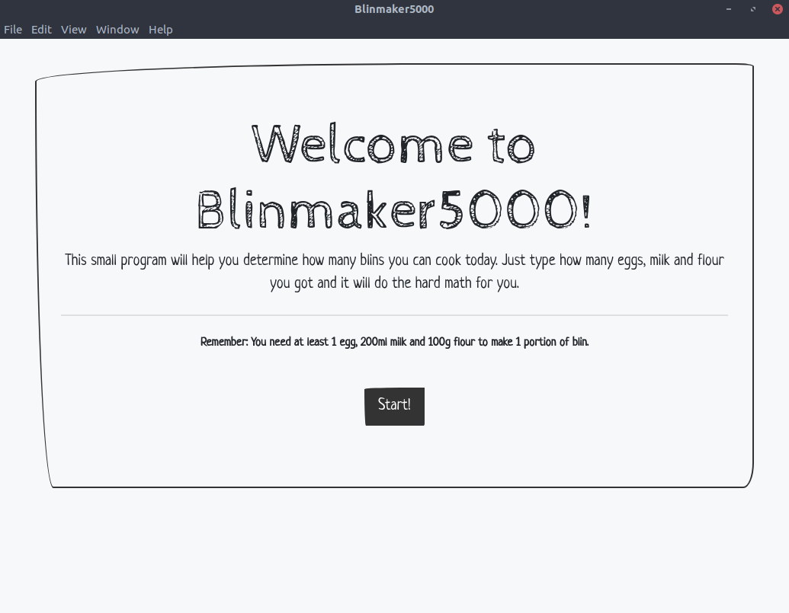

# Blinmaker5000

Calculate how many blins you can cook today!

## What the blin?!

'Blin' is the russian word for 'pancake' (and also the family friendly version
of a very bad russian swear word also starting with b) and that's what this
small program is about: You tell it how many eggs, milk and flour you got and
it will tell you in return how many blins you can cook. Brilliant!

## Why?

Because I saw [this video](https://www.youtube.com/watch?v=FMIZEfjYmtM) of
'Life of Boris' and got inspired to do a fun little version of the blinmaker
myself. So, special thx to Boris!

## How does it work?

Just enter your amount of ingredients in the forms, hit enter and finally hit
the Calculate!-Button. Like shown below:

## Credits

### Images

Images in the carousel are from [Pexels](https://www.pexels.com/royalty-free-images)
and royalty free.

- [Eggs](https://www.pexels.com/photo/brown-eggs-on-brown-wooden-bowl-on-beige-knit-textile-162712/?utm_content=attributionCopyText&utm_medium=referral&utm_source=pexels) by [Pixabay](https://www.pexels.com/@pixabay?utm_content=attributionCopyText&utm_medium=referral&utm_source=pexels)

- [Cow](https://www.pexels.com/photo/white-brown-cow-234791/?utm_content=attributionCopyText&utm_medium=referral&utm_source=pexels) by [freestocks.org](https://www.pexels.com/@freestocks?utm_content=attributionCopyText&utm_medium=referral&utm_source=pexels)
 
- [Flour](https://www.pexels.com/photo/flour-in-a-jar-5765/?utm_content=attributionCopyText&utm_medium=referral&utm_source=pexels) by [Kaboompics.com](https://www.pexels.com/@kaboompics?utm_content=attributionCopyText&utm_medium=referral&utm_source=pexels)

## Lastly...

Make sure you subscribe to [LifeofBoris](https://www.youtube.com/lifeofboris)
and stay cheeki breeki!
